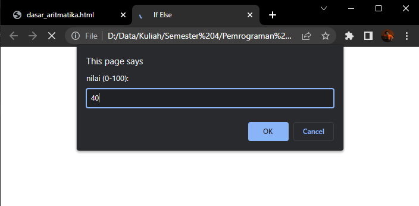
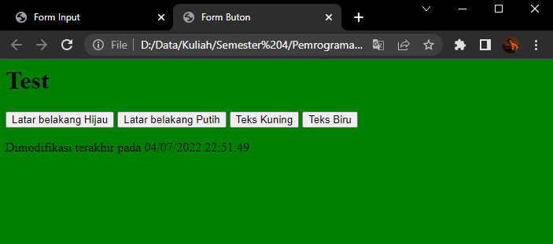

# Lab5Web

## Tugas Praktikum 5
Praktikum 5 : Javascript

Nama    : Faza Ardan Kusuma <br>
NIM     : 312010001<br>
Kelas   : TI 20 B1

<hr>

## Pengenalan Javascript
Disini saya buat dokumen html dengan nama file <b>lab5_javascript.html</b> dengan syntax seperti berikut :
```
<!DOCTYPE html>
<html lang="en">
<head>
    <title>Mengenal Javascript</title>
</head>
<body>
    <h1>Pengenalan JavaScript</h1>
    <h3>Contoh document.write dan console.log</h3> 
    <script> 
        document.write("Hello World"); 
        console.log("Hello World"); 
    </script>
</body>
</html>
```
Lalu saya buka file tersebut dalam <i>Google Chrome</i> dan menekan F12 dan pilih sub menu <i>Console</i>.<br>

Hasilnya :<br>
<br>

## Pemakaian Alert sebagai property window
Saya akan mencoba membuat Alert pada window. Berikut syntaxnya :<br>
```
<html></html>
<head>
    <title>Alert Box</title>
</head>
<body>
    <script language = "JavaScript">
        <!--
            window.alert("ini merupakan pesan anda");
        //-->
    </script>
</body>
</html>
```
Tampilan output :<br>
<br>

## Pemakaian method dalam objek
Saya mencoba menampilkan teks dengan javascript. Berikut syntaxnya :<br>
```
<html>
<head>
    <title>Skrip JavaScript</title>
</head>
<body>
    <script language = "JavaScript">
        <!--
            document.write("Selamat mencoba javascript <br>");
            document.write("Semoga Sukses!");
        //-->
    </script>
</body>
</html>
```

Tampilan output :<br>
<br>

## Pemakaian Prompt
Cara menggunakan prompt atau input data, sebagai berikut syntaxnya :<br>
```
<html>
<head>
    <title>Pemasukan Data</title>
</head>
<body>
    <script lang="Javascript">
        <!--
          var nama = prompt("Siapa nama anda?, masukkan nama anda");
          document.write("hai, " + nama); 
        //-->
    </script>
</body>
</html>
```

Output :<br>
Akan muncul seperti berikut, dan kita disuruh menginput nama<br>
<br>
Setelah menginput nama, maka jadi seperti berikut<br>
<br>

## Pembuatan fungsi dan cara pemanggilannya
Disini saya akan membuat sebuah fungsi dan cara memanggilnya. Berikut syntaxnya :<br>
```
<html>
<head>
    <title>Contoh Program Javascript</title>
    <script lang="javascript">
        function pesan(){
            alert("Memanggil javascript lewat body onload");
        }
    </script>
</head>
<body onload = pesan()>
</body>
</html>
```

Output :<br>
<br>
Disini <b>function</b> berfungsi sebagai <b>fungsi</b> dan saya memanggilnya dalam body dengan <b>onload = pesan()</b><br>

## Operasi dasar aritmatika
Disini saya akan membuat dasar aritmatika yang sudah ditentukan tanpa kita menginput angka atau data dan hanya perlu menekan satu tombol saja. Berikut syntaxnya :<br>
```
<html>
<head>
    <title>Operasi Dasar Aritmatika</title>
    <script lang="javascript">
        function test (val1,val2)
        {
            document.write("<br>"+"Perkalian : val1*val2"+"<br>")
            document.write(val1*val2)
            document.write("<br>"+"Pembagian : val1/val2"+"<br>")
            document.write(val1/val2)
            document.write("<br>"+"Penjumlahan : val1+val2"+"<br>")
            document.write(val1+val2)
            document.write("<br"+"Pengurangan : val1-val2"+"<br>")
            document.write(val1-val2)
            document.write("<br>"+"Modulus : val1%val2"+"<br>")
            document.write(val1%val2)
        }
    </script>
</head>
<body>
    <input type="button" name="button1" value="arithmatic" onclick="test(9,4)">
</body>
</html>
```

Output :<br>
Disini saya buat tombol aritmatik, dimana setelah kita menekan tombol tersebut baru keluar dasar aritmatiknya.<br>
<br>
<br>

## If & Else
Saya akan mencoba seleksi kondisi <b>if</b> & <b>else</b>. Saya akan buat standar nilai, bila dicapai maka outputnya akan <b>Lulus</b> dan bila tidak tercapai maka akan <b>Tidak Lulus</b>. Standar nilainya adalah 60, berikut syntaxnya :
```
<html>
<head>
    <title>If Else</title>
</head>
<body>
    <script lang="javascript">
        <!--
          var nilai = prompt("nilai (0-100): ", 0);
          var hasil = "";
          if (nilai >= 60)
          hasil = "Lulus";
          else
          hasil = "Tidak Lulus";
          document.write("hasil: "+ hasil);
        //-->
    </script>
</body>
</html>
```

Output :<br>
Disini saya mencoba input angka 80<br>
<br>
Maka hasilnya <b>Lulus</b><br>
<br>
Lalu saya mencoba input angka 40<br>
<br>
Maka hasilnya <b>Tidak Lulus</b>
<br>

## Penggunaan Operator Switch
Untuk menyeleksi suatu kondisi, disini saya akan mencoba menggunakan operator switch. Saya akan membuat inputan nilai 1 - 5, lalu bila kita memilih salah satu dari angka tersebut maka akan keluar output itu bilangan berapa. berikut syntaxnya :
```
<html>
<head>
    <title>Operator Switch</title>
    <script lang="javascript">
        function test()
        {
            vall=window.prompt("Input nilai (1-5) : ")
            switch (vall)
            {
                case "1" :
                    document.write("Bilangan satu")
                    break
                case "2" :
                    document.write("Bilangan dua")
                    break
                case "3" :
                    document.write("Bilangan tiga")
                    break
                case "4" :
                    document.write("Bilangan empat")
                    break
                case "5" :
                    document.write("Bilangan lima")
                    break
                default :
                document.write("Bilangan lainnya")
            }
        }
    </script>
</head>
<body>
    <input type="button" name="button1" value="switch" onclick=test()>
</body>
</html>
```

Output :<br>
<br>
Disini saya mencoba input angka 4<br>
<br>
Maka hasilnya <br>
<br>

## Pembuatan Form Input
Saya akan membuat form input angka lalu nanti akan ada tombol untuk menampilkan apakah angka tersebut bilangan genap atau ganjil, berikut syntaxnya :<br>
```
<html>
<head>
    <title>Form Input</title>
    <script lang="javascript">
        function test()
        {
            var vall = document.kirim.T1.value
            if (vall%2==0)
                document.kirim.T2.value="Bilangan genap"
            else
                document.kirim.T2.value="Bilangan ganjil"
        }
    </script>
</head>
<body>
    <form method="Post" name="kirim">
        <p>BIL <input type="text" name="T1" size="20">
        Merupakan BIL <input type="text" name="T2" size="20"></p>
        <p><input type="button" value="TEBAK" name="B1" onclick=test()></p>
    </form>
</body>
</html>
```

Output :<br>
<br>
Saya mencoba masukan angka 3, maka :<br>
<br>
Lalu saya coba masukan angka 4, hasilnya :<br>
<br>

## Pembuatan Form Button
Saya akan membuat 4 button dimana masing - masing button mempunyai fungsi masing - masing, yaitu merubah warna background dan merubahwarna text, barikut syntaxnya :<br>
```
<html>
    <title>Form Buton</title>
</head>
<body>
    <script lang="javascript">
        <!--
        function ubahWarnaLB(warna){
            document.bgColor = warna;
        }
        function ubahWarnaLD(warna){
            document.fgColor = warna;
        }
        //-->
    </script>

    <h1>Test</h1>
    <form>
        <input type="button" value="Latar belakang Hijau" onclick="ubahWarnaLB('GREEN')">
        <input type="button" value="Latar belakang Putih" onclick="ubahWarnaLB('WHITE')">
        <input type="button" value="Teks Kuning" onclick="ubahWarnaLD('YELLOW')">
        <input type="button" value="Teks Biru" onclick="ubahWarnaLD('BLUE')">
    </form>
    <script lang="javascript">
        <!--
          document.write("Dimodifikasi terakhir pada " +
          document.lastModified);  
        //-->
    </script>
</body>
</html>
```

Output : <br>
Ini adalah tampilan awal<br>
<br>
Kemudian saya tekan button <b>Latar belakang Hijau</b><br>
<br>
Lalu saya menekan button <b>Teks Kuning</b>, hasilnya :<br>
<br>


## Pilihan menggunakan checkBox dengan perhitungan otomatis

Saya akan membuat sebuah menu dan harga dengan checkbox dan perhitungan secara otomatis bila chechbox terceklist. Berikut syntaxnya :<br>
```
<!--
    File: daftar_menu.html
//-->
<html>
<head>
    <title>Daftar Menu</title>
    <script>
        function hitung(ele){
            var total = document.getElementById('total').value;
                total = (total ?   parseInt(total) : 0);
            var harga = 0;

            if(ele.checked){
                harga = ele.value;
                total +=parseInt(harga);
            } else {
                harga = ele.value;
                if(total > 0)
                total -= parseInt(harga);
            }
            document.getElementById('total').value = total;
        }
    </script>
</head>
<body>
    <h1>Daftar Menu Makanan</h1>
    <label><input type ="checkbox" value="5000" id="menu1" onclick="hitung(this);" /> Ayam Goreng Rp.5000</label><br/>
    <label><input type ="checkbox" value="500" id="menu2" onclick="hitung(this);" /> Tempe Goreng Rp.500</label><br/>
    <label><input type ="checkbox" value="2500" id="menu3" onclick="hitung(this);" /> Telur Dadar Rp.2500</label><br
    <strong>Total Bayar : Rp. <input id="total  " type="text"/></strong>
</body>
</html>
```

Hasilnya :<br>


<hr>

## Pertanyaan dan Tugas
1. Buat script untuk melakukan validasi pada isian form.

<hr>

## Jawaban Tugas
Saya membuat form validasi berupa inputan nama, email dan alamat. Bila ada yang tidak terisi makan akan muncul peringatan bahwa data kurang lengkap. Berikut syntaxnya :<br>
```
<!DOCTYPE html>
<html lang="en">
<head>
    <meta charset="UTF-8">
    <meta http-equiv="X-UA-Compatible" content="IE=edge">
    <meta name="viewport" content="width=device-width, initial-scale=1.0">
    <title>Form Validasi</title>
    <style>
    body {
        background: black;
        font-family: 'Gill Sans', 'Gill Sans MT', Calibri, 'Trebuchet MS', sans-serif;
      }
       
      h2 {
        color: green;
      }
       
      .login {
        padding: 1em;
        margin: 2em auto;
        width: 17em;
        background: #fff;
        border-radius: 3px;
      }
       
      label {
        font-size: 10pt;
        color: #555;
      }
       
      input[type="text"],
      input[type="email"],
      textarea {
        padding: 8px;
        width: 95%;
        background: #efefef;
        border: 0;
        font-size: 10pt;
        margin: 6px 0px;
      }
       
      .tombol {
        background: green;
        color: #fff;
        border: 0;
        padding: 5px 8px;
      }
    </style>
</head>
<body>
    <center><h2>Form Pendaftaran</h2></center>
	<div class="login">
		<form action="#" method="POST" onSubmit="validasi()">
			<div>
				<label>Nama Lengkap:</label>
				<input type="text" name="nama" id="nama" />
			</div>
			<div>
				<label>Email:</label>
				<input type="email" name="email" id="email" />
			</div>
			<div>
				<label>Alamat:</label>
				<textarea cols="40" rows="5" name="alamat" id="alamat"></textarea>
			</div>
			<div>
				<input type="submit" value="Daftar" class="tombol">
			</div>
		</form>
	</div>
</body>
<script type="text/javascript">
	function validasi() {
		var nama = document.getElementById("nama").value;
		var email = document.getElementById("email").value;
		var alamat = document.getElementById("alamat").value;
		if (nama != "" && email!="" && alamat !="") {
			return true;
		}else{
			alert('Data anda tidak lengkap!');
		}
	}
</script>
</html>
```

Dan ini hasilnya :<br>
<br>
<br>